# Dream Tea House
Scenario: Dream Teahouse is a newly established premium teashop that offers a unique, high-quality tea blend as its flagship product. To portray their commitment to providing an exceptional tea-drinking experience, Dream Teahouse plans to create an informational website that will serve as an online resource for tea enthusiasts and potential customers. 
## Deployment
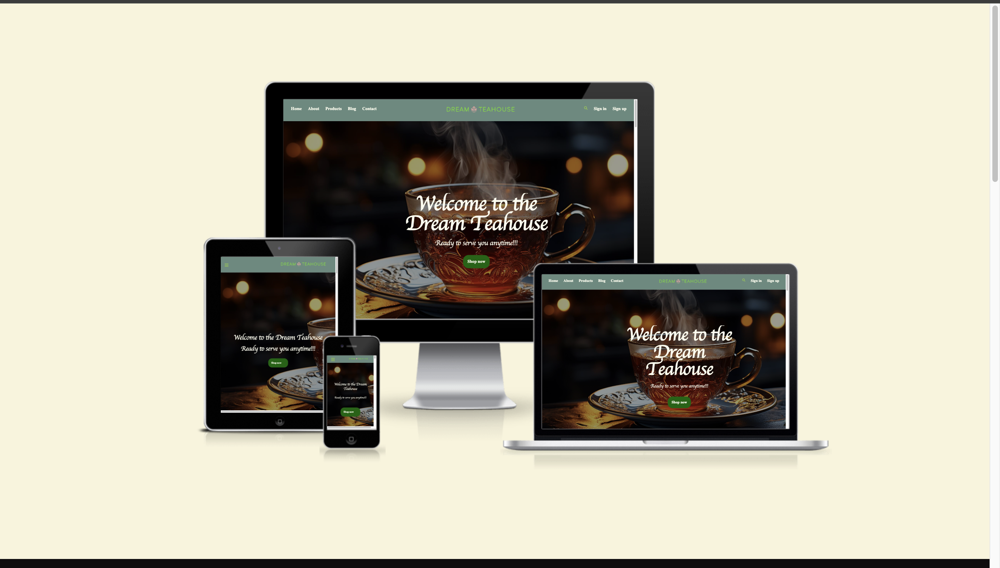
This is the live website and repo:
* [Dream Teahouse](https://jonfd4.github.io/portfolioproject1-repeat/product-page.html)
* [Repositiory](https://github.com/JonFD4/portfolioproject1-repeat.git)
### To deploy on github
1. Sign in to github and find the right repository.
2. Click on settings and then pages.
3. Under build and deployment, make sure set the source: "Deploy from a branch" and Branch: "main" - another dropdown will I appear beside this; make sure the selected item is "file icon/root".
4. Click save to begin the building process. When the page is refreshed the link to the live deployment website will be available at the top.

### Forking the GitHub Repository
By forking the GitHub Repository we make a copy of the original repository on our GitHub account to view and/or make changes without affecting the original repository by using the following steps...

1. Log in to GitHub and locate the GitHub Repository.
2. At the top of the Repository (not top of page) just above the "Settings" Button on the menu, locate the "Fork" Button.
3. You should now have a copy of the original repository in your GitHub account.
   
### Making a Local Clone
1. Log in to GitHub and find the GitHub Repository
2. Under the repository name, click "Clone or download".
3. To clone the repository using HTTPS, under "Clone with HTTPS", copy the link.
4. Open Git Bash
5. Change the current working directory to the location where you want the cloned directory to be made.
6. Type git clone, and then paste the URL you copied in Step 3.
     ```bash
     $ git clone https://github.com/JonFD4/projectportfolio2-0.git
     ```
7. Press Enter. Your local clone will be created.
---
<br>
# Overview
Create a functional and aesthetically pleasing website that is responsive, considers accesbility and is user-friendly.

**Remaking portfolio one**


## Design process
## User Perspective:
As a potential customer or a tea enthusiast, visiting Dream Teahouse's website, the user would expect the following:

1. Product Details: Users would want comprehensive information about the tea blend, including its unique flavors, origins, the ingredients used, and the detailed brewing instructions. This will help them understand the quality and uniqueness of the product.

2. Mission and Story: Users are interested in learning about the teashop's mission, values, and the story behind the creation of the signature tea blend. This information gives them a deeper connection and understanding of the brand.

3. Tea Education: Users would want access to educational content about tea, such as brewing tips, information on different types of tea, health benefits, and the proper way to serve and enjoy tea. They desire a platform that not only offers products but also educates and enriches their tea-drinking experience.

4. Product Availability: Users would appreciate a section that informs them about where the product can be purchased, both online and in physical stores. Details about shipping options, retail partners, and any upcoming events or promotions would be useful.

## Familiarity of users
**First time user**
* I want to understand the primary goal of the site.
* I want to the website to be easily navigable through the website and clear directions as well as CTAs.
* I want to find product sections and learn about the purpose of each product.
 * I want exploration and usage of the site to be intuitive
 
 **Returning and/ or Frequent user**
 * I want exploration and usage of the site to be intuitive
 * I want to be able to readily and easily purchase products


## Developer Perspective:
When developing the website for Dream Teahouse, the website developer would focus on the following aspects:

1. Engaging Design: The developer would create an aesthetically pleasing and user-friendly website design that aligns with the teahouse's brand identity. The design should evoke a sense of tranquility and elegance, reflecting the essence of tea.

2. Responsive Design: The developer would prioritize making the website fully responsive, ensuring it functions seamlessly across various devices (desktops, tablets, and mobile phones). This enhances the user experience and accessibility.

3. Integration of Multimedia: To enhance the user experience, the developer may integrate multimedia elements such as high-resolution images and videos demonstrating tea brewing techniques. These elements can make the website more engaging and informative.

4. SEO Optimization: The developer would implement search engine optimization techniques to improve the website's visibility on search engines. This helps potential customers find Dream Teahouse easily when searching for tea-related information or products.

5. The developers aims to make use and achieve understanding of the potential of CSS and its implementation for web development.
---
## Planning
* Imagery: The images used are vital in conveying peace and traquility witouth overshadowing the writting context of the page. The ones used in the products sections are to attract user and give them an idea of the product they will be receiving.

* Colours: Notably, the primary colour seen consitently is green colour palette. This represents health. Additional colours including black and white used, especially on text, is to create contrast.

* Fonts: `cursive, sans-serif` font used creates elegance and keeps the page from being overly uniformed and boring.

### WireFrames
Balsamiq was used in the design of the website.

The structure of the image was designed with the intention that not all of it will be implemented in the website, due to stylistic changes and determine what fits the aim of the website.

<details>
<summary> Lo-fi prototyping of dream tea house website with balsamiq</summary>

* Desktop wireframe
  - [Landing page 1](docs/ReadmeImg/Dream-Teahouse-planning/landing-page.png)
  - [Landing page 2](docs/ReadmeImg/Dream-Teahouse-planning/dream-teahouse-landing-page.png)
  - [About](docs/ReadmeImg/Dream-Teahouse-planning/About-us.png)
  - [product carousel section](docs/ReadmeImg/Dream-Teahouse-planning/product-carousel.png)
  - [popular product section](docs/ReadmeImg/Dream-Teahouse-planning/popular-product.png)
  - [blog section](docs/ReadmeImg/Dream-Teahouse-planning/Blog-desktop.png)
  - [footer section](docs/ReadmeImg/Dream-Teahouse-planning/footer.png)
  <br>
* Mobile wireframe
    - [landing page mobile 1](docs/ReadmeImg/Dream-Teahouse-planning/mobile-layout/smaller-screen-landing-page.png)
    - [landing page mobile 2](docs/ReadmeImg/Dream-Teahouse-planning/mobile-layout/pt2-landing-page-mobilepng.png)
     - [About ](docs/ReadmeImg/Dream-Teahouse-planning/mobile-layout/smaller-screen-about.png)
     - [product carousel mobile screen](docs/ReadmeImg/Dream-Teahouse-planning/mobile-layout/product-carousel-smaller-screen.png)
     - [Full product page](docs/ReadmeImg/Dream-Teahouse-planning/mobile-layout/product-html-smaller-screen.png)
</details>

## Features
<details> 
<summary> Description of Home page</summary>

**Landing Page**
<br>


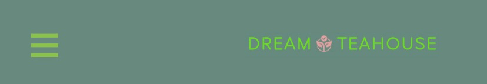
* The navigation bar is fully responsive, and redirects to the user:
  - about, blog,contact and sign page. The home button reloads the page.
  - The elements are styled so that as user hovers background changes.
  - the responsive styling converts the navigation bar to a hamburger menu that retains all features.
  - the navigation bar can be seen through out all the web pages. Except for the thank you pages
    - in the sign in page the sign in and sign up buttons are removed. These are replaced with my account and checkout buttons in product page.

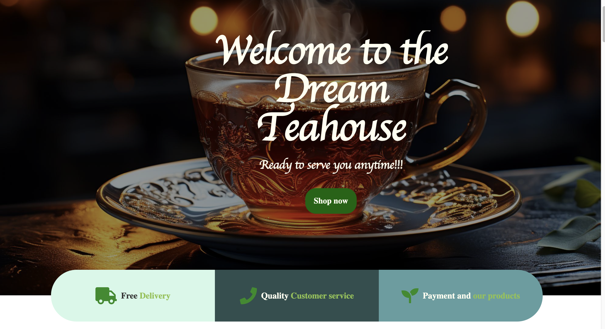
* The landing page, on load, shows a fade in of the welcome text.
* The button underneath directs user to product section
* There are also three buttons: 
  - Free delivery does not direct user.
  - Quality customer service directs user to contact
  - Payments and our products directs user to product page.

**About section**
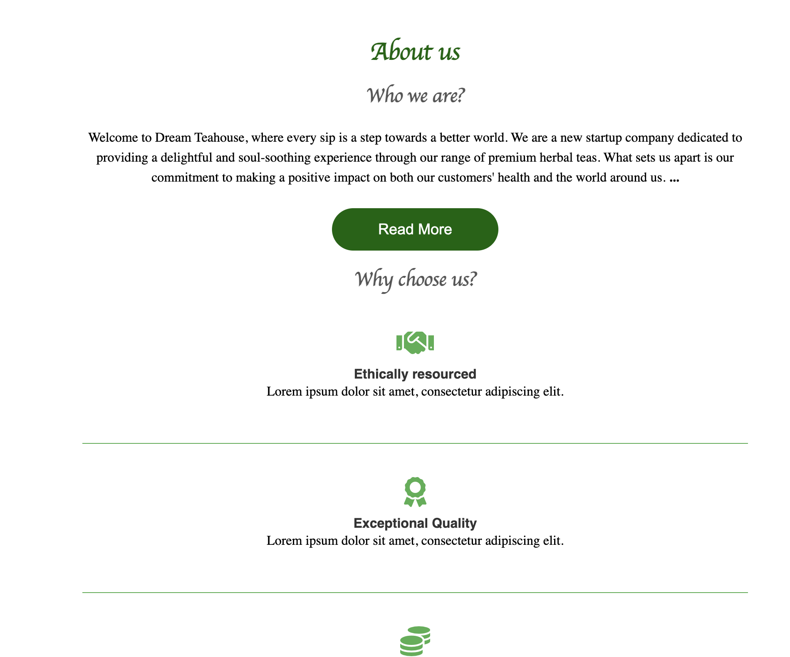
* The about page gives details about the company and their mission for ethical productions.
* The button when clicked shows more details. This function is implemented using JS.

**Product section**
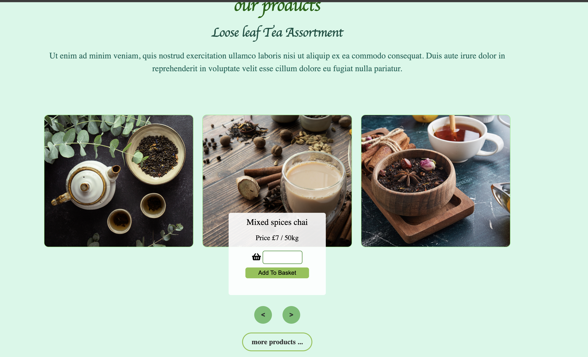
* The product section acts as a precursor to the whole product page. It allows user to view some interesting and popular products.
* It has scroll function that shows images three at a time and one at a time when screen width is reduced.
* The more product button sends user to the product page.

**Knowmore section**

* The image inspire calm and relaxation related to the product.
* Hovering over the text causes the scale to increase.
* The button sends user to an article about the product.
**Blog section**
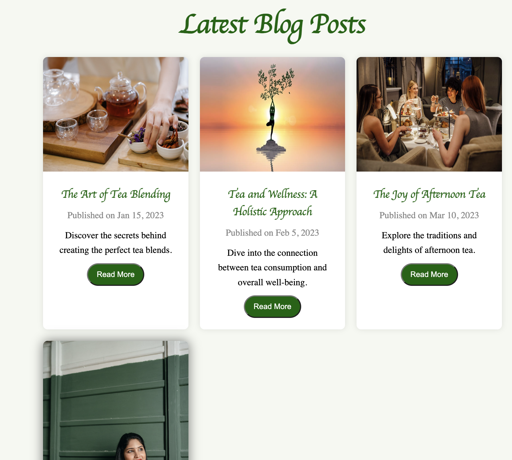
* The blog section consists of a number of articles that when hovered on the box shadow effect appears.
* The buttons do not direct user to anywhere.

**location and contact**
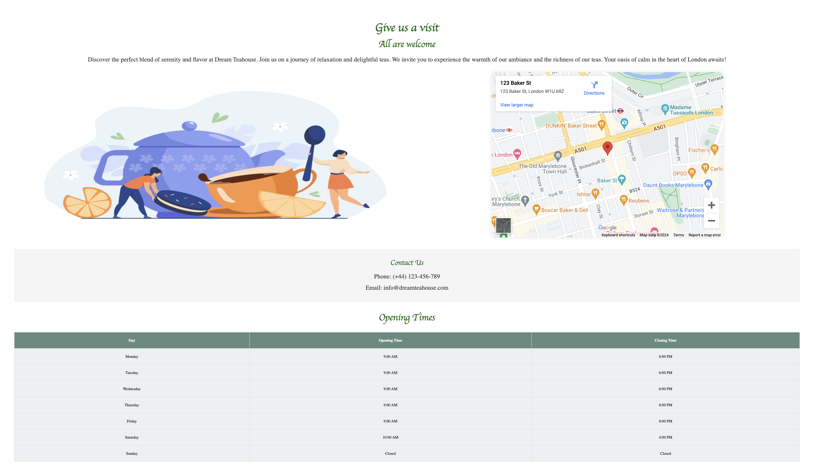
* The location section shows a whimsical image to attract customers, a map, opening times, and  contact information.

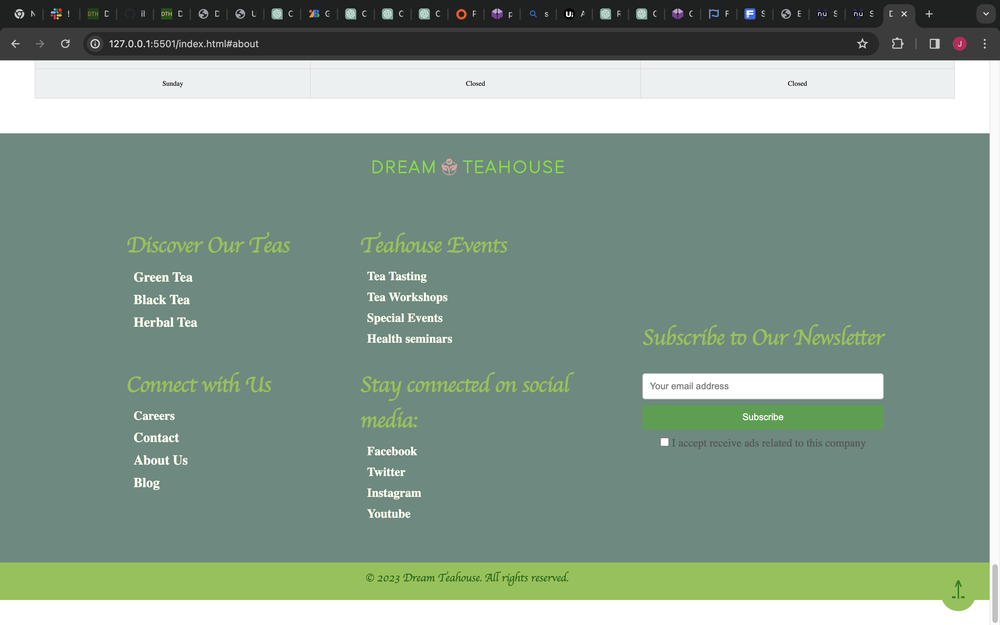
* The footer consists of empty text to represent buttons. (All elements under `teahouse events`, `stay connected on social media`,and `careers` )
* Hovering over the text causes the scale to increase.
* Elements of `Discover out tea` direct user to product page
* Subscribe newsletter button directs user to thank you page
* It also has a button that directs user to the top of the page
</details>
<details>
<summary> Description of product page </summary>

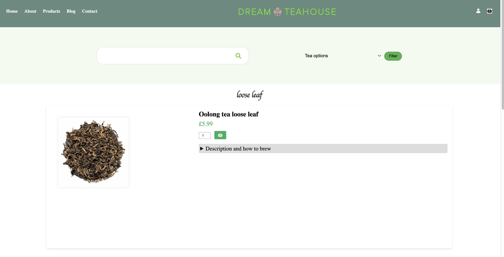
* The navbar is similar to that of index page, however on the right side are two buttons- check out and a person icon- my account.
* It maintains the same functionality as the index page. The buttons present will direct user to the sections on index.html.
* the responsive feature remains the same.
* Each product is in a tile. A button to chose the number of products the user wants and beside is the basket icon.
* The description feature reveals the product details and how to use it.

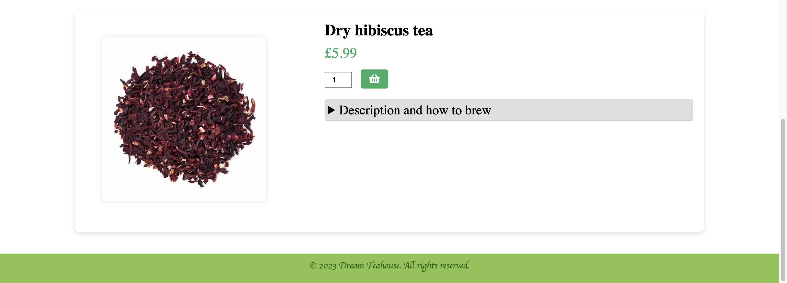
* This footer is simply a copyright statement.
</details>

<details>
<summary> Description of sign page and thank you page</summary>

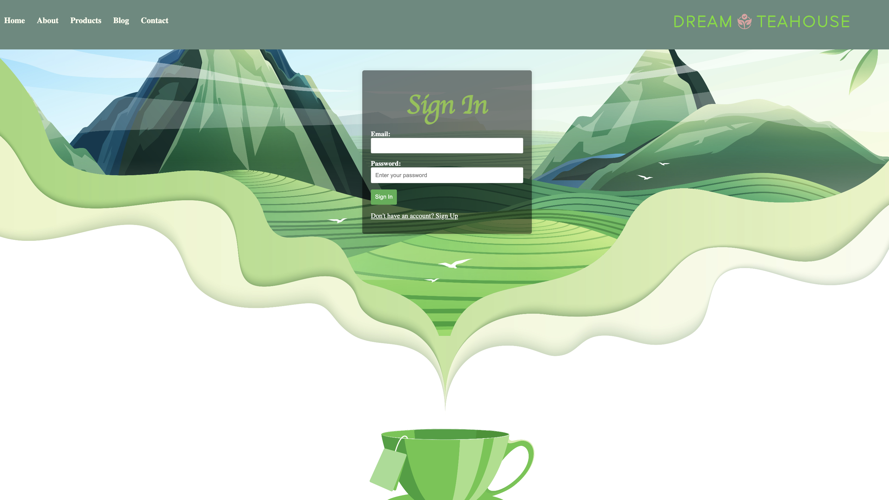
* The sign page shows the input section against a beautiful backdrop which maintains the serene feel this website aims for.
* The sign section is styled to ensure that the input is filled before submit button directs user to another page.
* The button on the sign-in section sends user to the home page. The button on the [sign-up section](docs/ReadmeImg/features/signupsection.png) sends user tp the thank you page.
* Javascript is used so that user can easily swith between the two state depending on what they require.

**Thank you**

* This page acknowledges the user.
* It also presents icons for the user to access the companies social media
* A link to send user to the home page

</details>


---

## Tools and technologies
 **Language**
 - CSS
 - JavaScript
 - HTML

**Tools**
- VS Code
- git and github
- Balsamiq

## Test and validation
validations was carried out and used to make necessary improvements to code for final products.
<details>
<summary> Lighthouse validation </summary>
The accessibility aspect of the code was challenging. Some flaws highlighted by lighthouse validator  and fixed by developer included: 

[Find lighthous errors](docs/ReadmeImg/validation-images/lighthouse)

**Landing page**
* forms id and label mismatch
* image loading issues: not fixed
* contrast issues

**Product page**
* Input label mismatch- labels not necessary
* buttons do no have accessibility names.

**Thank you page**
No meta description

* Background image loading issues on the homepage
 - This caused reduction in accessibility and performance. Nonetheless, the other pages had better performance and accessibility.
</details>

<details>
<summary>Fixing and debugging<summary>

* lighthous errors were fixed and tested again. Some errors such as image loading were not resolved since they will break the website.

* There were a few minor errors with CSS according to jigsaw validator. The errors can be seen in [here](docs/ReadmeImg/validation-images/cssjigsaw.png). These were fixed.

* A lot of the [w3c erros](docs/ReadmeImg/validation-images/w3c) found through out the html were similar:
 most consist of bad practices and trail slashing. I took note of this and took teh effective time to make the relevant changes in accordance with w3c validation standards.

* The very low performance of the homepage was because of the hero background images and animation. This feature was taken out.
</details>

<details>
<summary>Errors not fixed<summary>

**Lighthouse home page**

* Background and foreground colors do not have a sufficient contrast ratio.
* '`<frame>` or `<iframe>`' elements do not have a title.
* Elements with visible text labels do not have matching accessible names.
* Image elements have [alt] attributes that are redundant text.

**lighthouse product page**
* Buttons do not have an accessible name
* Elements with visible text labels do not have matching accessible names.
* Image elements have [alt] attributes that are redundant text.
* Select elements do not have associated label elements.
</details>

### Form testing
* Forms were tested to and ensured to send user to the right location
* Developer ensured forms indicated required alert when user clicked on submit button

### links testing
* The links were verified to make sure they sent user to the right location
* Social media elements were not presented as links since there is no page to direct user.

### Browser Testing
The Website was tested on Google Chrome, Firefox, and safari browsers with no major issues noted except for the display of favicon.

### Responsiveness testing
* [Responsive checker](https://www.responsivedesignchecker.com/checker.php?url=https%3A%2F%2Fjonfd4.github.io%2Fportfolioproject1-repeat%2F&width=1400&height=700)
* [Amiresponsive](docs/ReadmeImg/validation-images/DTH-amiresponsive.png)